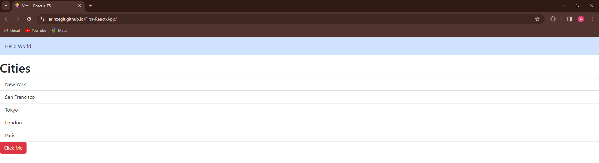

# First React App

## Context and Description
This is my very first web page in React. This project introduced me to the basic concepts in React. I used this project to practice the following:
* Reusable components
* JSX (JavaScript XML) syntax
* Props
* State
* Event handling in JSX
* Conditional rendering using ternary operator or logical && operator
* Lists and keys
* Hooks in functional components
## How to run
* Ensure you have a modern web browser installed
* Open the index.html file in the production build located in the 'gh-pages' branch
* The project should now be visible in your browser  
- Or you can visit the live site URL [here](https://arinzegit.github.io/First-React-App/)
## Technologies used
* HTML
* CSS
* JSX (JavaScript XML) - Syntax extension for JavaScript
* [Bootstrap](https://getbootstrap.com/) - CSS Framework
* [TypeScript](https://www.typescriptlang.org/) - Programming language that extends JavaScript
* [React](https://react.dev/) - JavaScript library
* [Node.js](https://nodejs.org/) - JavaScript runtime environment
* [Vite](https://vitejs.dev/) - React build tool with local development server
## Challenges faced during development
* Being my first project in React, syntax was a bit overwhelming so I installed extensions into my Code editor:
  * [ES7+ React/Redux/React-Native snippets](https://marketplace.visualstudio.com/items?itemName=dsznajder.es7-react-js-snippets) to help me write code more efficiently by providing shortcuts for commonly used code patterns
  * [Prettier - Code formatter](https://prettier.io/) to maintain a consistent code style across my entire codebase 
